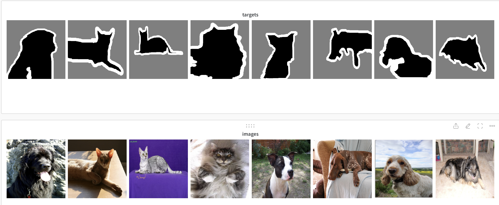

# Semantic-Segmentation


## Introduction

The goal is to perfrom semantic segmentation on the [Oxford-IIIT Pet Dataset](https://www.robots.ox.ac.uk/~vgg/data/pets/). 

## Model

U-Net based Archtircure impemeted from scratch using pytorch-lightning found in `Unet.py`.

## RESULTS

The model achived a mean IoU of 0.8495 and a mean Dice Coefficient of 0.8861 on the validation set.



## Training

To train the model, run `train.py` with the following arguments:

```
python train.py --log_dir /path/to/log/dir
```

